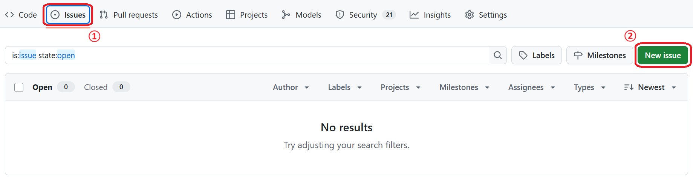

# ? **GitHub Copilot エージェントを使用した 旅行アプリケーション開発**

## ? **Hands-Onの目次**
1. **[Hands-Onの目的](#-hands-onの目的)**
2. **[旅行アプリケーションの概要](#?-旅行アプリケーションの概要)**
3. **[Hands-Onの手順一覧](#-hands-onの手順一覧)**
4. **[Hands-Onの手順](#-hands-onの手順)**  

## ? **Hands-Onの目的**
GitHub Copilot エージェントの AI アシスタント機能を活用して、旅行アプリケーションに新機能を効率的に実装する方法を学習します。Issue の作成、Copilot エージェントへの割り当て、およびAI駆動開発のワークフローを実践的に体験します。

---

## ?? **旅行アプリケーションの概要**

このハンズオンで使用するのは、**Next.js** で構築された包括的な旅行アプリケーションです。以下の主要機能を持っています：

### ?? **主要機能**
- **旅行検索・予約**: 目的地やカテゴリでの高度な検索機能
- **旅行ガイド**: エキスパートによる目的地の詳細ガイド  
- **予約管理**: ユーザーの予約履歴と管理機能
- **ポイントシステム**: ロイヤルティプログラムとポイント追跡

### ?? **技術仕様**
- **フレームワーク**: Next.js 14 (App Router)
- **言語**: TypeScript
- **スタイリング**: Tailwind CSS
- **アーキテクチャ**: サーバーコンポーネント & クライアントコンポーネント

## ? **Hands-Onの手順一覧**

このハンズオン演習では、GitHub Copilot エージェントを使用して以下のステップを実行します：

1. **[GitHub Issue の作成](#1-github-issue-の作成)**: サポートメニュー機能のためのIssue作成
2. **[Copilot エージェントへの割り当て](#2-copilot-エージェントへの割り当て)**: Issue を Copilot エージェントに自動割り当て
3. **[エージェント実装の監視](#3-エージェント実装の監視)**: Copilot による自動実装プロセスの確認
4. **[追加機能のIssue作成](#4-追加機能のissue作成)**: 検索フィルター機能の実装要求

---

## ? **Hands-Onの手順**

### **1. GitHub Issue の作成**

#### **? Issue #1: サポートメニューの実装**
1-1. **GitHub リポジトリのIssueページに移動**    
 -  ブラウザで GitHub リポジトリを開く  
 - 「Issues」タブをクリック  
 - 「New issue」ボタンをクリック  
    ※参考画像  
    

1-2. **Issue 入力**  
 - **Issue タイトルの入力**
```
サポートメニュー項目の追加実装
```

 - **Issue 詳細内容の入力**
```markdown
## 概要
メインナビゲーションに「サポート」メニュー項目を実装する新しい機能を追加します。

## 要件
「サポート」セクションには、以下の主要コンポーネントを含める必要があります：

- **FAQ ページ**: よくある質問に対応し、一般的な問い合わせでユーザーを支援する専用ページ
- **問い合わせフォーム**: ユーザーがサポートリクエストやフィードバックを直接送信できるインタラクティブなフォーム
- **連絡先情報**: さらなる支援のための関連する連絡先詳細を表示するセクション

## 技術要件
- Next.js App Router パターンに従う
- TypeScript インターフェースを使用
- Tailwind CSS でスタイリング
- レスポンシブデザイン対応
- アクセシビリティ考慮

## 受け入れ条件
- [ ] ナビゲーションにサポートリンクが追加される
- [ ] FAQページが実装される
- [ ] 問い合わせフォームが動作する
- [ ] 連絡先情報ページが表示される
- [ ] すべてのページがモバイル対応している
```
※参考画像


---

### **2. Copilot エージェントへの割り当て**

2-1. **Issue に Copilot エージェントを割り当て**  
 - Issue の右サイドバーで「Assignees」セクションを探す  
 - 「@copilot」を入力してCopilotエージェントを割り当て  
 - または Issue コメントで以下を入力：  
    
```
@copilot この issue を実装してください
```

※issueに担当者としてCopilotエージェントの場合  
※参考画像①  
  
※参考画像②  


#### **? エージェントの動作確認**

2-2. **Copilot エージェントの応答確認**  
 - Issue コメント欄でCopilotからの応答を待つ  
 - エージェントが実装計画を提示することを確認  

2-3. **実装プロセスの開始**  
 - Copilot が新しいブランチを作成  
 - 必要なファイル構造を自動生成  
 - コンポーネントの実装を開始  

#### **? プロセス監視のポイント**
- **ブランチ作成**: 新機能用の適切なブランチ命名
- **ファイル構造**: Next.js のベストプラクティスに準拠した配置
- **コード品質**: TypeScript型安全性とTailwind使用

---

### **3. エージェント実装の監視**

#### **? 実装確認手順**

3-1. **作成されたプルリクエストの確認**  
 - GitHub の「Pull requests」タブを確認  
 - Copilot が作成したPRを詳しく確認  
  

3-2. **コード品質の検証**  
```markdown
確認項目：
- [ ] TypeScript 型定義が適切
- [ ] コンポーネント構造が整理されている
- [ ] Tailwind CSS クラスが使用されている
- [ ] アクセシビリティ属性が含まれている
- [ ] レスポンシブデザインが実装されている
```

3-3. **ローカル環境での動作確認**  
※ハンズオンでは省略しますが、本格運用では必須のステップです 。
 - 実装された機能が要件通りに動作することを確認  
 - モバイル・デスクトップでのレスポンシブ対応をチェック   

#### **? Copilot との協力ポイント**  
- **フィードバック提供**: 改善点があればIssueコメントで指示  
- **追加要件**: 必要に応じて詳細な仕様を追加  
- **承認プロセス**: 要件を満たしていればPRを承認  

---

### **4. 追加機能のIssue作成**

#### **? Issue #2: 検索フィルター拡張**

4-1. **2つ目のIssueを作成**

**Issue タイトル:**
```
検索メニューの高度なフィルタリング機能追加
```

**Issue 詳細内容:**
```markdown
## 概要
既存の検索機能に高度なフィルタリングオプションを追加し、ユーザー体験を向上させる。

## 要件
以下の検索オプションを含む検索メニューに高度なフィルタリングオプションを実装：

1. **国別検索**: 旅行先を国別でフィルタリング
2. **カテゴリフィルターに新しいカテゴリ「Food」を追加**: 食べ物・グルメ関連の旅行体験

## 技術仕様
- 既存のSearchFormコンポーネントを拡張
- 新しいSelectコンポーネントを追加
- フィルター状態管理をReactフックで実装
- URLパラメータでフィルター状態を保持

## 受け入れ条件
- [ ] 国選択ドロップダウンが追加される
- [ ] Foodカテゴリが選択可能になる
- [ ] フィルター結果がリアルタイムで反映される
- [ ] URL状態が適切に管理される
```

4-2. **同様にCopilotエージェントに割り当て**
```
@copilot この検索フィルター機能も実装してください
```
4-3. **同様にCopilotエージェントの生成物をレビュー**

## ? **まとめ**

この演習では、GitHub Copilot エージェントの力を活用して：

- **? 効率的な機能開発** - AIエージェントによる自動実装
- **? 高品質なコード生成** - Next.jsベストプラクティスに準拠  
- **? AI駆動開発** - 人間とAIエージェントの効果的なコラボレーション体験

GitHub Copilot エージェントは単なるコード生成ツールではなく、開発チームの **自動化されたメンバー** として機能し、開発生産性を飛躍的に向上させます。

---
