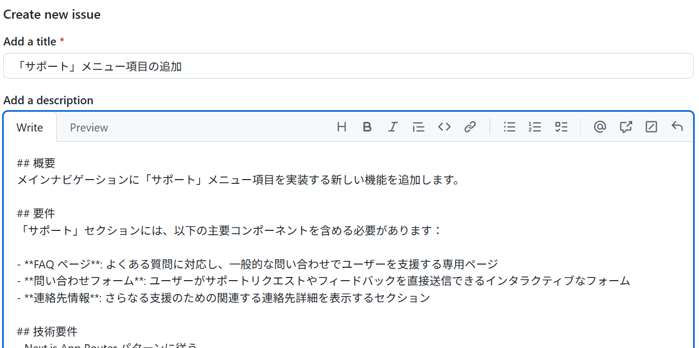

# 演習 1: GitHub Issue の作成

| [← 前の手順](./0-prereqs.md) | [次の手順: Copilot エージェントへの割り当て →](./2-copilot-agent-assignment.md) |
|:--|--:|

この演習では、サポートメニュー機能の実装を依頼するための GitHub Issue を作成する方法を学習します。適切な Issue 作成は、Copilot エージェントが高品質なコードを生成するための重要な第一歩です。

## シナリオ

旅行アプリケーションのユーザーから、「問題が発生したときにサポートに連絡する方法がわからない」という フィードバックが複数寄せられました。プロダクトマネージャーから、包括的なサポートメニューの実装を依頼されました。

この機能を手動で実装する代わりに、GitHub Copilot エージェントを活用して効率的に開発を進めます。

## GitHub Issue の作成手順

### ? 必須 1. GitHub リポジトリのIssueページに移動

1. ブラウザで GitHub リポジトリを開く
2. 「Issues」タブをクリック
3. 「New issue」ボタンをクリック


### ? 必須 2. Issue タイトルの入力

明確で具体的なタイトルを入力します：

```
サポートメニュー項目の追加実装
```

> [!TIP]
> **良いIssueタイトルの条件:**
> - 実装する機能が一目でわかる
> - 技術的すぎず、ビジネス価値も伝える
> - 50文字以内に収める

### ? 必須 3. Issue 詳細内容の入力

以下の詳細内容をコピー＆ペーストして入力します：

```markdown
## 概要
メインナビゲーションに「サポート」メニュー項目を実装する新しい機能を追加します。

## 要件
「サポート」セクションには、以下の主要コンポーネントを含める必要があります：

- **FAQ ページ**: よくある質問に対応し、一般的な問い合わせでユーザーを支援する専用ページ
- **問い合わせフォーム**: ユーザーがサポートリクエストやフィードバックを直接送信できるインタラクティブなフォーム
- **連絡先情報**: さらなる支援のための関連する連絡先詳細を表示するセクション

## 技術要件
- Next.js App Router パターンに従う
- TypeScript インターフェースを使用
- Tailwind CSS でスタイリング
- レスポンシブデザイン対応
- アクセシビリティ考慮

## 受け入れ条件
- [ ] ナビゲーションにサポートリンクが追加される
- [ ] FAQページが実装される
- [ ] 問い合わせフォームが動作する
- [ ] 連絡先情報ページが表示される
- [ ] すべてのページがモバイル対応している
```



### ? 必須 4. Issue の投稿

1. 入力内容を確認
2. 「Submit new issue」ボタンをクリック
3. Issue番号を控える（後の手順で使用）

## ? Issue 作成のベストプラクティス

### 効果的な Issue 記述のポイント

1. **明確な概要**: 何を実装するかを簡潔に説明
2. **詳細な要件**: 機能の具体的な内容を箇条書きで記載
3. **技術的制約**: 使用すべき技術スタックやパターンを明記
4. **受け入れ条件**: 完了の定義を明確化

### Copilot エージェントが理解しやすい記述

- **構造化された文書**: マークダウン形式で階層化
- **具体的な技術用語**: Next.js、TypeScript、Tailwindなど
- **明確な成果物**: 「ページ」「フォーム」など具体的なコンポーネント
- **チェックリスト形式**: 受け入れ条件を確認しやすく

## ? 実装予定機能の技術的詳細

### FAQページの構成
- よくある質問の一覧表示
- カテゴリ別フィルタリング機能
- 検索機能（オプション）

### 問い合わせフォームの要素
- 氏名、メールアドレス、件名、本文
- フォームバリデーション
- 送信完了メッセージ

### 連絡先情報ページ
- 会社情報、電話番号、営業時間
- 地図表示（オプション）
- SNSリンク

## まとめと次のステップ

GitHub Issue の作成が完了しました。適切に構造化された Issue により、Copilot エージェントは以下を理解できます：

- 実装すべき機能の範囲
- 使用すべき技術スタック
- 品質基準と受け入れ条件

次のステップでは、作成した Issue を Copilot エージェントに割り当て、自動実装プロセスを開始します。

## リソース

- [GitHub Issues のベストプラクティス](https://docs.github.com/en/issues/tracking-your-work-with-issues/creating-an-issue)
- [効果的な要件定義の方法](https://docs.github.com/en/communities/using-templates-to-encourage-useful-issues-and-pull-requests)

---

| [← 前の手順](./0-prereqs.md) | [次の手順: Copilot エージェントへの割り当て →](./2-copilot-agent-assignment.md) |
|:--|--:|