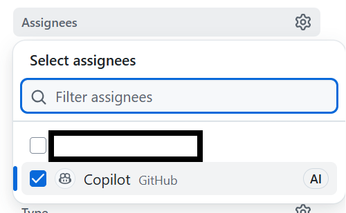
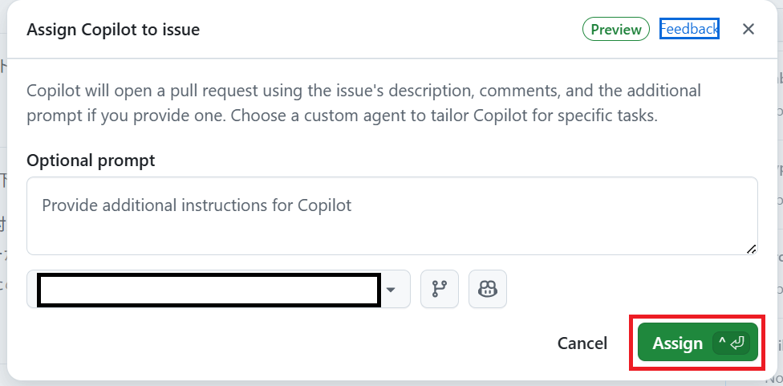

# 演習 2: Copilot エージェントへの割り当て

| [← 前の手順](./1-github-issue-creation.md) | [次の手順: エージェント実装の監視 →](./3-monitor-implementation.md) |
|:--|--:|

この演習では、作成した GitHub Issue を Copilot エージェントに割り当てる方法と、エージェントの応答を確認する手順を学習します。適切な割り当てにより、Copilot エージェントが自動的に実装作業を開始します。

## シナリオ

前の演習で「サポートメニュー項目の追加実装」の Issue を作成しました。従来であれば、この Issue を開発者に割り当てて手動での実装を依頼していましたが、今回は Copilot エージェントに割り当てることで、AI による自動実装を体験します。

## Copilot エージェントへの割り当て方法

### ? 必須 方法 1: Assignees セクションの使用

1. 作成した Issue の右サイドバーを確認
2. 「Assignees」セクションを探す
3. 「@copilot」と入力してCopilotエージェントを選択
4. 割り当てを確定





### ? オプション 方法 2: コメントによる割り当て

Issue のコメント欄に以下のメッセージを入力：

```
@copilot この issue を実装してください
```

> [!TIP]
> **コメント割り当ての利点:**
> - より具体的な指示を追加できる
> - 実装アプローチを提案できる
> - チームメンバーに割り当てプロセスが見える

## ? 必須 Copilot エージェントの応答確認

### エージェントの初期応答

Copilot エージェントが割り当てを受け取ると、通常以下のような応答をします：

1. **タスクの理解確認**: Issue の内容を分析し、理解した内容を要約
2. **実装計画の提示**: どのようなファイル構造で実装するかの計画
3. **技術的アプローチ**: 使用する技術やパターンの説明
4. **実装開始の告知**: 新しいブランチ作成と実装開始の通知

### ? 参考 典型的なエージェント応答例

```markdown
## 実装計画

サポートメニュー機能の実装を承りました。以下の計画で進めます：

### ファイル構造
- `app/support/layout.tsx` - サポートセクションのレイアウト
- `app/support/page.tsx` - サポートトップページ
- `app/support/faq/page.tsx` - FAQページ
- `app/support/contact/page.tsx` - 問い合わせフォーム
- `app/support/info/page.tsx` - 連絡先情報
- `components/support/` - サポート関連コンポーネント

### 技術的アプローチ
- Next.js App Router パターンを使用
- TypeScript による型安全性の確保
- Tailwind CSS によるレスポンシブデザイン
- フォームバリデーションの実装

実装を開始します...
```

## ? 必須 実装プロセスの開始

### 自動ブランチ作成

Copilot エージェントは以下のような流れで作業を開始します：

1. **新しいブランチの作成**: `copilot-support-menu-implementation` のような名前
2. **ファイル構造の生成**: 必要なディレクトリとファイルの作成
3. **段階的実装**: コンポーネントごとの順次実装
4. **プルリクエストの作成**: 実装完了後の自動PR作成

### ? 必須 監視すべきポイント

エージェントの作業開始後、以下の点を確認しましょう：

- [ ] 適切なブランチ名が作成されている
- [ ] Next.js のベストプラクティスに沿ったファイル配置
- [ ] TypeScript による型定義の実装
- [ ] Tailwind CSS クラスの適切な使用
- [ ] コンポーネントの適切な分割

## ? オプション エージェントとの効果的なコミュニケーション

### 追加指示の提供

実装中に追加の要望がある場合、Issue コメントで指示できます：

```
@copilot FAQ ページに検索機能も追加してください
```

### 実装方針の調整

技術的なアプローチを変更したい場合：

```
@copilot フォームの実装にはReact Hook Formライブラリを使用してください
```

### 品質要件の追加

品質基準を明確にしたい場合：

```
@copilot 各ページにアクセシビリティ属性（ARIA）を適切に追加してください
```

## ?? トラブルシューティング

### エージェントが応答しない場合

1. **権限の確認**: リポジトリでCopilot エージェント機能が有効か確認
2. **再割り当て**: 一度 Assignees から外して再度割り当て
3. **メンション**: `@copilot` でのメンションを再度実行

### 期待と異なる応答の場合

1. **要件の明確化**: より具体的な指示をコメントで追加
2. **例の提供**: 期待するコードサンプルを示す
3. **制約の追加**: 技術的制約をより詳細に説明

## まとめと次のステップ

Copilot エージェントへの Issue 割り当てが完了しました。エージェントは以下のプロセスで作業を進めます：

- **自動分析**: Issue の要件を詳細に分析
- **計画立案**: 実装アプローチと技術選択を決定  
- **実装実行**: コードの自動生成とファイル構造の作成
- **品質確保**: ベストプラクティスに沿った実装

次のステップでは、エージェントの実装プロセスを監視し、生成されたコードの品質を評価する方法を学習します。

## リソース

- [GitHub Copilot エージェント 公式ガイド](https://docs.github.com/en/copilot/github-copilot-chat/copilot-chat-in-github)
- [効果的なAI協働開発の方法](https://docs.github.com/en/copilot/using-github-copilot/best-practices-for-using-github-copilot)

---

| [← 前の手順](./1-github-issue-creation.md) | [次の手順: エージェント実装の監視 →](./3-monitor-implementation.md) |
|:--|--:|