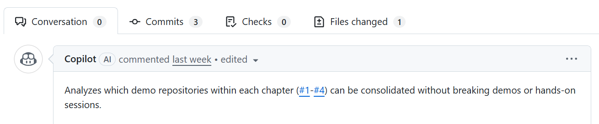

# 演習 3: エージェント実装の監視

| [← 前の手順](./2-copilot-agent-assignment.md) | [次の手順: 追加機能のIssue作成 →](./4-advanced-features.md) |
|:--|--:|

この演習では、Copilot エージェントによるコード実装プロセスを監視し、生成されたコードの品質を評価する方法を学習します。AI による自動実装を効果的に活用するためのレビュープロセスを体験します。

## シナリオ

Copilot エージェントがサポートメニュー機能の実装を開始しました。AI による自動実装は非常に便利ですが、生成されたコードが要件を満たし、品質基準に適合していることを確認する必要があります。

開発チームのリーダーとして、エージェントの実装プロセスを監視し、必要に応じてフィードバックを提供することが今回のタスクです。

##  1. 実装プロセスの監視

### ? 参考 Copilot エージェントの実装フロー



エージェントは通常、以下の順序で実装を進めます：

1. **ブランチ作成**: 機能開発用の新しいブランチ
2. **ファイル構造生成**: 必要なディレクトリとファイルの作成
3. **コンポーネント実装**: UIコンポーネントの段階的な実装
4. **ルーティング設定**: Next.js App Router の設定
5. **スタイリング適用**: Tailwind CSS による見た目の調整
6. **プルリクエスト作成**: 実装完了後の自動PR作成

### ? 必須 リアルタイム監視のポイント

実装中に確認すべき要素：

- **ファイル命名**: Next.js の規約に従っているか
- **ディレクトリ構造**: App Router パターンに適合しているか  
- **コンポーネント設計**: 再利用可能で保守しやすい構造か
- **型定義**: TypeScript の恩恵を適切に活用しているか

## ? **必須** 2. プルリクエストの確認

### ? 必須 PR確認手順

1. GitHub の「Pull requests」タブを開く
2. Copilot が作成したPRを選択
3. 「Files changed」タブで変更内容を詳細確認
4. 各ファイルの実装内容をレビュー

### ? 必須 コード品質チェックリスト

以下の項目を確認してコードの品質を評価します：

#### Next.js ベストプラクティス

- [ ] **App Router パターン**: `app/` ディレクトリの適切な使用
- [ ] **Server Components**: 適切なサーバーコンポーネントの活用
- [ ] **Client Components**: `'use client'` の必要最小限の使用
- [ ] **ファイル命名**: `page.tsx`、`layout.tsx` の正確な命名

#### TypeScript 品質

- [ ] **型定義の完全性**: プロパティとステートの適切な型付け
- [ ] **インターフェース設計**: 再利用可能な型定義
- [ ] **型安全性**: any型の不適切な使用がないか
- [ ] **エクスポート/インポート**: 明確なモジュール境界

#### コンポーネント設計

- [ ] **単一責任原則**: 適切に分割されたコンポーネント
- [ ] **プロパティ設計**: 明確で使いやすいAPI
- [ ] **状態管理**: 適切なReactフックの使用
- [ ] **エラーハンドリング**: 適切なエラー処理の実装

#### UI/UX品質

- [ ] **Tailwind CSS**: 適切なユーティリティクラスの使用
- [ ] **レスポンシブデザイン**: モバイル・デスクトップ対応
- [ ] **アクセシビリティ**: ARIA属性と意味的なHTML
- [ ] **ユーザビリティ**: 直感的で使いやすいインターフェース

## ? **参考** 3. 実装内容の詳細確認

### ? 参考 生成されるファイル構造例

```
app/
└── support/
    ├── layout.tsx           # サポートセクションのレイアウト
    ├── page.tsx            # サポートトップページ
    ├── faq/
    │   └── page.tsx        # FAQページ
    ├── contact/
    │   └── page.tsx        # 問い合わせフォーム
    └── info/
        └── page.tsx        # 連絡先情報

components/
└── support/
    ├── FAQSection.tsx      # FAQ表示コンポーネント
    ├── ContactForm.tsx     # 問い合わせフォームコンポーネント
    └── ContactInfo.tsx     # 連絡先情報コンポーネント
```

### ? 参考 重要なファイルの確認ポイント

#### `app/support/layout.tsx`
- サポートセクション共通のレイアウト
- ナビゲーション メニューの実装
- 適切なメタデータの設定

#### `components/support/ContactForm.tsx`
- フォームバリデーションの実装
- エラーメッセージの表示
- 送信処理の適切なハンドリング

#### `components/support/FAQSection.tsx`
- アコーディオン形式のUI
- 検索・フィルタリング機能
- アクセシブルな展開/折りたたみ

## ? **オプション** 4. エージェントとのコラボレーション

### ? オプション 改善フィードバックの提供

実装に問題がある場合、Issue またはPRコメントでフィードバック：

```
@copilot 問い合わせフォームにフォームバリデーションが不足しています。
以下の検証を追加してください：
- メールアドレスの形式チェック
- 必須フィールドの入力確認
- 文字数制限の設定
```

### ? オプション 機能追加の依頼

追加の要件がある場合：

```
@copilot FAQページに以下の機能を追加してください：
- カテゴリ別のフィルタリング
- キーワード検索機能
- よく閲覧されるFAQの表示順位調整
```

### ? オプション コードスタイルの調整

チームのコーディングスタンダードに合わせる場合：

```
@copilot コンポーネントの props 型定義を interface ではなく type で定義してください。
プロジェクトの統一基準に合わせるためです。
```

## ? **参考** 5. 品質確認のベストプラクティス

### ? 参考 段階的レビュー

1. **高レベル設計**: ファイル構造とアーキテクチャ
2. **コンポーネント設計**: 個別コンポーネントの品質
3. **詳細実装**: ロジックとエラーハンドリング
4. **UI/UX**: 見た目と使い勝手

### ? 参考 レビュー観点の優先順位

1. **機能要件**: Issue で定義した要件をすべて満たしているか
2. **技術品質**: ベストプラクティスに従った実装か
3. **保守性**: 将来の変更や拡張に対応しやすいか
4. **パフォーマンス**: 効率的で高速な実装か

##  6. 承認とマージ

### ? 必須 承認基準

以下がすべて満たされた場合にPRを承認：

- [ ] すべての受け入れ条件が満たされている
- [ ] コード品質チェックリストをすべてクリア
- [ ] 技術的負債や将来の問題点がない
- [ ] チームのコーディング基準に適合している

### ? 必須 マージの決定

```
@copilot 実装内容を確認しました。すべての要件が満たされており、
コード品質も問題ありません。このPRを承認します。
```

## まとめと次のステップ

Copilot エージェントの実装プロセス監視が完了しました。このプロセスで学んだ重要なポイント：

- **AI実装の品質管理**: 自動生成されたコードも適切なレビューが必要
- **継続的なフィードバック**: エージェントとの対話による品質向上
- **標準への適合**: チームの開発標準とベストプラクティスの維持

次のステップでは、さらに高度な機能として検索フィルターの拡張機能を実装するための新しいIssueを作成します。

## リソース

- [コードレビューのベストプラクティス](https://docs.github.com/en/pull-requests/collaborating-with-pull-requests/reviewing-changes-in-pull-requests)
- [Next.js 開発ガイドライン](https://nextjs.org/docs/getting-started/project-structure)
- [TypeScript コーディング規約](https://www.typescriptlang.org/docs/handbook/declaration-files/do-s-and-don-ts.html)

---

| [← 前の手順](./2-copilot-agent-assignment.md) | [次の手順: 追加機能のIssue作成 →](./4-advanced-features.md) |
|:--|--:|